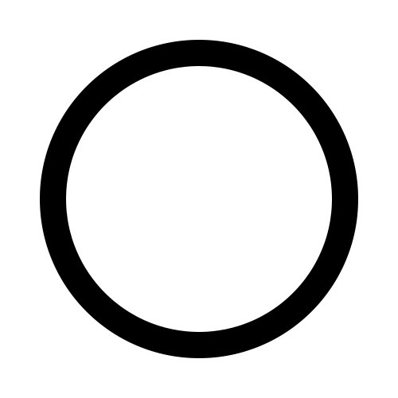
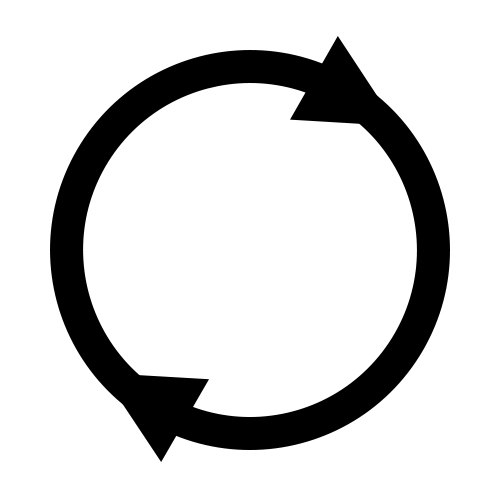
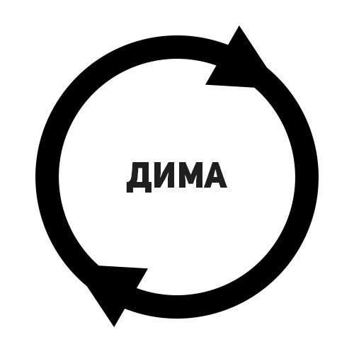
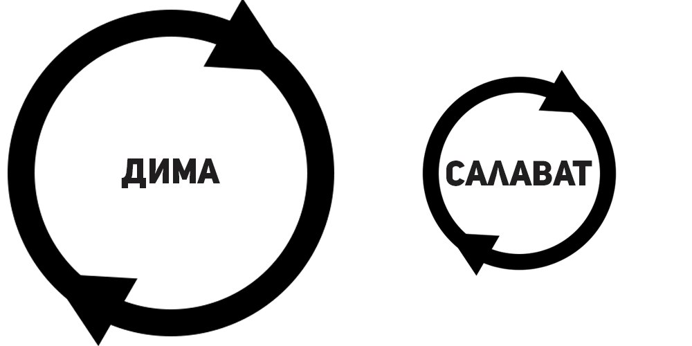
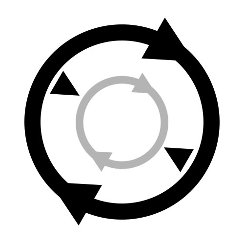
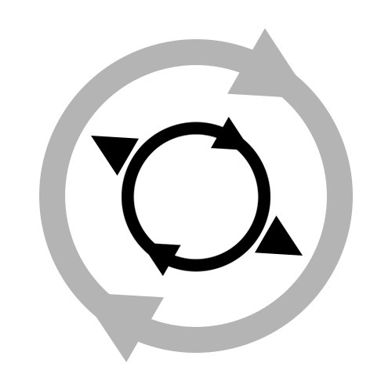
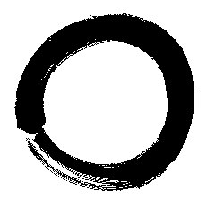

> Ты видишь крайне упрощенную визуализацию идеи, которую я опишу. А еще этот круг означает, что полученный мысленный вывод замотивировал меня написать о нём статью. Интересно?

## О людях

Существуют люди, которые меня всегда удивляли. Как бы я не пытался понять их секрет путём расспросов или размышлений, мне не удавалось, да и они сами, похоже, не знали своего секрета. Такие люди просто подсознательно живут эффективнее чем остальные, как будто они понимают, что нужно делать, чтобы в итоге получить больше чем рядовой обыватель. Я не являюсь таким и искренне завидую. Именно внезапное осознание позволило мне приблизиться к пониманию причин и следствий .

Вернемся к кругу и добавим деталей.

> Это замкнутый круг, вечное движение, продукция и потребление, причина и следствие.

## Аналогия

Теперь постарайся представить, что в у тебя есть персональный наркодиллер. Тебе нужны от него, конечно же, наркотики, а ему от тебя — правильное поведение с точки зрения твоей бабушкиНе нужно перечитывать это снова, просто продолжай. Он щедро одаривает наркотой каждый раз, когда ты ведешь себя как послушный внук. Но мнение бабушки о том, как нужно жить, уже не соответствует современным условиям. Ты понимаешь это и начинаешь хитрить. Говоришь наркодиллеру, что бабушка была и будет тобой довольна, а он верит. Затем ты начинаешь врать барыге все чаще.

В итоге:

- ▲ У тебя быстрая и лёгкая наркота. Никаких рисков, просто и комфортно.
- ▲ У обманутой бабули иллюзия благополучия. Но на неё всем плевать.
- ▲ У наркодиллера все чаще не оказывается наркотиков, даже если ты действительно решил поступить по-честному.

## Смысл

Ты — это по прежнему ты.
Барыга — твой мозг и система вознаграждения.
Бабуля — эволюция и инстинкты оставленные ею.
Наркотики — дофамин и прочие эндонаркотики.
Аналогия — ужасная (но я все равно её оставил).

Таким образом мы получаем удовольствие, если рационально ведем себя с точки зрения эволюции. Если "по-обезьяньи" живём, иными словами, а ведь это итог очень долгой истории проб и ошибок. Но все переломилось в тот момент, когда появилось сознание. Эволюция будто не ожидала, что мы обретем много лишнего в голове и получим способность к созданию искусственных условий для своего существования. В этих условиях уже не обязательно быть обезьяной, чтобы получать подарки от барыги. Достаточно лишь иллюзии, не затрачивающей много энергии, не расходующей потенциал и не снижающей темпов энтропии во вселенной.
И вот живут люди в своих иллюзорных условиях, потребляют "легкие наркотики" и почему-то все кругом несчастные, ничего не добившиеся и преисполнены надежд на светлое будущее. Разве не жизненно?
В цивилизованных странах больше не выживают. Естественный отбор никому не нужен если инвалид учит здоровых людей, как надо жить. Мы целиком погрязли в мнимых стимулах и иллюзиях. Потребляем и обеспечиваем себя всем необходимым сполна, а кто-то и более того.

## О детстве

Детство каждого, кто вырос не в эпоху интернета, еще пока что дает о себе знать, как о чём-то простом, но и неуловимо сложном. Кажется тогда мы были по-настоящему счастливы. Но всё изменилось. Что же произошло?
Произошел paradigm shift. Бабушкины законы уже не работают. Искусcтвенные условия стали ещё изощреннее и теперь существенно проще получать дофамин. Пожалуй, осталось рукой подать до будущего, где от нас ничего не потребуется для получения удовольствия и это будет страшный кризис.

## О круге

Снова вернёмся к кругу. Скажем, что имеет значение только его размер и он будет эквивалентен абстрактной совокупной затраченной энергии абстрактного Димы Еримеева. То есть, чем больше диаметр круга, тем больше длинна окружности, что означает, что Димка тратит больше сил на то, чтобы круг замкнулся и пошел по-новой. Чем это хорошо? Димка затратил много энергии, использовал в какой-то степени свой потенциал и получил свой приз — дофамин, а ещё "премию" от использования потенциала (какие-либо материальные и нематериальные блага). А абстрактный Салават Байназаров, его приятель, чей круг меньше, получил, в принципе, столько же дофамина, но затратил меньше времени и сил. В чём секрет Салаватки? Ответ прост, Салават онанировал на бесплатное порно без смс. А Димка занялся здоровым сексом с реальным человеком. Это простейший пример, хоть и грубый. В этом и есть суть.

## Об удовольствиях

Мы получаем дофамин за многие действия, но основа такова:

- ▲ Поддержание и сохранение жизни (еда, к примеру, особенно калорийная)
- ▲ Создание потомства (секс, хоть он уже и реже приводит к зачатию)
- ▲ Борьба за доминантность (лидерство, победа, признание, успех и прочее)
- ▲ Есть еще мнение, что нашему сознанию крайне необходима самотрансценденция, но это уже к вопросу об экзонаркотиках, духовных практиках и религиях.

И любая деятельность, так или иначе, упирается в эти основополагающие цели. Иначе бы не было мотивации. Иначе бы не было эволюции. Всё остальное — толстый пласт фрейдистской рационализации. Он подобен сливочному крему, поверх сочных шоколадных коржей.

## О моих зависимостях

В моём постсовковом детстве жизнь была непроста, а дофамин я получал не за "просто так". Меня уже окружало много информации, но я продолжал испытывать визуальный голод (отсюда развитая фантазия у детей Y-поколения).
До появления "сеги" под елкой я рисовал, коллекционировал наклейки в тетради, играл во дворе и дома во что придётся, много фантазировал. Потом создавал свою настольную игру, в периоды, когда отец жалел о том, что купил мне "эту сегу" и прятал её. В общем я был "успешен". Купался в "премиях" и продолжал использовать свой потенциал. Однако телевизор и, в особенности, приставки всё лучше удовлетворяли визуальный голод, плюс развивалась их способность создавать иллюзию доминантности (победы). Потом у меня появилась "сониплейстешн" (еще более крутая графика!), потом "компьютер" (видеоигры уже не ограничивались одной только иллюзией доминантности). Власть отца была ничтожна против моего коварства, я был готов горы свернуть, лишь бы не копать огород с дофаминовыми клубнями ложкой, когда есть спрятанная лопата (конечно же при условии, что "сворачивание гор" отнимет меньше энергии чем "вскопка огорода"). То есть, я уже крепко подсел и вёл себя как обычный зависимый. Помимо того, я еще "сидел" на сладком и мастурбации, а творчеством почти не занимался.

## О твоих зависимостях

Теперь замени видеоигры на любой "наркотик", способный дать тебе дофамин проще и быстрее, чем энергозатратным и требующим потенциала путём, и ты поймешь, что все мы подсажены на свои "иглы".
Каждая нас насыщает дофамином и вот мозг уже удовлетворён, а день еще только начался. Ничего, скоро вечер, можно перетерпеть, "докинуться" и лечь спать. Ну или терпишь ненавистную работу весь день, а потом вечерком "расслабляешься как царь" в компании подруги-рюмочки и приятеля-телевизора. Придумай свой подобный сценарий, умножь его на много лет и получишь образ жизни искалеченных, с точки зрения нейробиологии, людей, надежды которых устремлены далеко в будущее, а многие сожаления в прошлое.

> Получается порочный круг: мы компенсируем такими "наркотиками" недостаток счастья, потом это становится привычкой, наш круг сужается по-немногу с каждым разом. Спустя время, получаем неспособность испытать истинное счастье и радость жизни, ведь весь дофамин уже использован на суррогат. А потенциал мы не использовали и изрядно сожалеем об утерянном времени. Знакомо?

## О выходах

Так как же сделать все по прежнему? Я вижу два выхода (но их, очевидно, больше):

- ▲ Либо свалить куда поглубже, чтобы оградиться от всех пороков цивилизации, как это советуют многие "просвященные". После нескольких недель страдальческой ломки, перезагрузиться и снова стать ребёнком. Чем моложе и здоровее организм, тем скорее и легче всё произойдет. Это радикальный метод и он не гарантирует, что всё снова не скатится в уныние и безысходность спустя время.
- ▲ Либо жестко и беспошадно дисциплинировать себя, заставляя вместо повседневных дрочек, игр, жратвы и наркотиков (в этот раз уже привычных всем, включая алкоголь, никотин, кофеин и прочие бытовые вещества), делать что-то трудозатратное ради удовольствия. Например, писать эту статью. Но почему я её всё таки пишу, а не скролю новости весь вечер как вчера? Ну во-первых, я начал воздержание еще за некоторое время, с целью посмотреть, что получится. А во-вторых, постарался представить, как после публикации собираю тысячи лайков и получаю всеобщее внимание.

Дофамин вырабатывается уже на старте, в момент представления цели. Чем убедительнее фантазии, тем устойчивее мотивация к ее свершению (в этом нам ещё помогают люди, чьи примеры нас вдохновляют, потому как их истории уже реальны). Хотя любая мотивация развеется если снова начать удовлетворять мозг простыми методами.

## О воздержании

В какой-то момент, пока писал это, понял, что вошел в состояние потока. Редкое для меня явление. Мне это стоило двухнедельного отдыха от игр, всего сладкого и мастурбации. А это мои главные "наркотики", ведь привычных всем не употребляю уже давно. Нету.
Кстати, никому сейчас не пришла в голову фрейдистская сублимация? Это можно обсудить в комментариях.

## О людях (заключение)

Так о каких людях я говорил? О тех, чье детство дало им возможность привыкнуть к более долгосрочному циклу получения удовольствия от жизни и они не хотят пробовать других способов. Это, пожалуй, наиболее счастливый тип людей, не считая тех кто пришел к Дзену и прочим просветлениям своими силами. А счастье есть не что иное, как успешная реализация своего потенциала.

