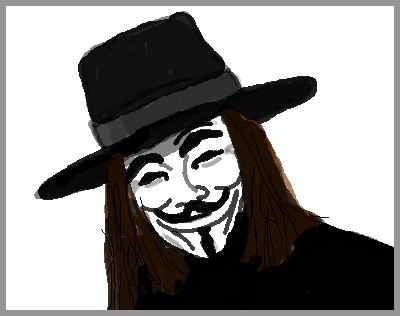
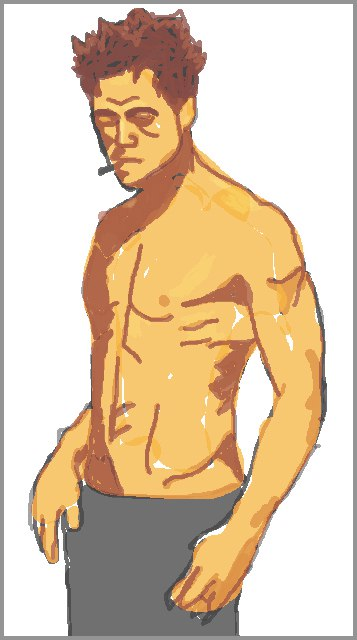
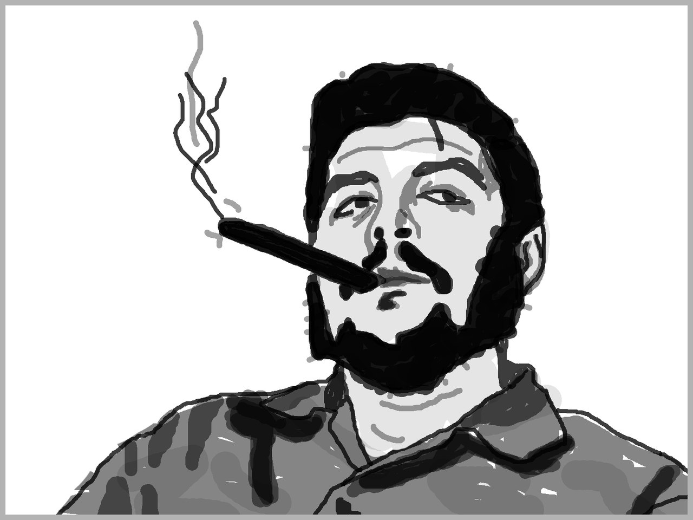
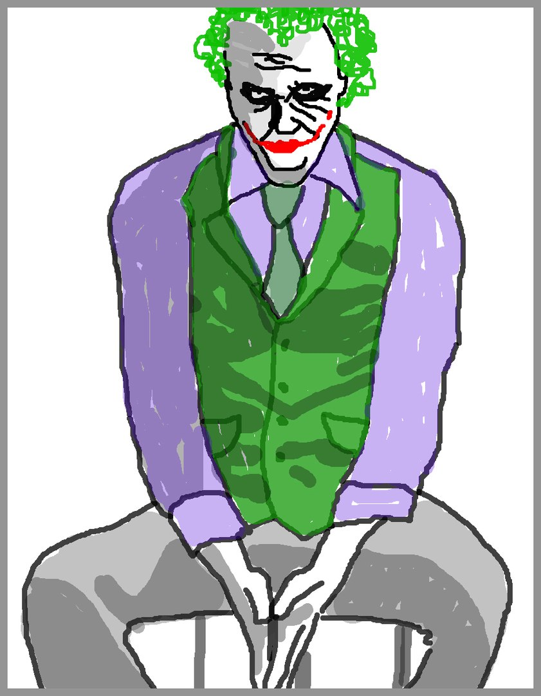

## Принцип нравственности

Не так давно Володя переосознал слово "принцип". Теперь это не детский инструмент рационализации своего поведения. Далее это выработанное на личном опыте универсальное правило для аспекта жизни, помогающее принимать решения. Отталкиваясь от осмысленных принципов мы избегаем лишних дум и растрат энергии, но всё равно в пользу результата. Принципы являются кирпичиками морали, но об этом позже. Первым таким правилом для Володи становится принцип нравственности и он решил его обозначить, потому как понимает, что, так или иначе, ему начал следовать.

## Нравственность против морали

Прежде чем описывать прелести этого принципа, стоит разобраться в привычных понятиях. Случается, что люди отождествляют мораль и нравственность. Это не редкость и так уж повелось. Но Володя склонен их разделять, ведь, по сути своей, они разные.

### Мораль

Мораль есть совокупность норм извне. Она принимается нами или навязывается социумом, ведь обществу интересно, чтобы правила соблюдались во избежание рисков. Прекрасными примерами являются правовые кодексы, своды смертных грехов и правила этикета. Мораль это не плохо и не хорошо в общем, однако в частных случаях может быть как полезна, так и вредна.

Зачастую мораль неосознанна и предполагает за собой убеждённость в наказании за нарушение норм (будь то осуждение, взыскание, лишение свободны, ад или тому подобное). Логика проста (одна плоскость) и она не требует осознанного понимания, нарушил запрет — должен быть наказан.

Ты наверное не раз слышал, что мораль является "нравственным ориентиром". Это так, но в том смысле, что человек избавляет себя от необходимости формировать свои принципы, основанные на нравственности, чем экономит много сил и времени. Предполагается, что все выводы уже 'эффективно сформированы на основе пройденных до тебя уроков, либо заранее предопределены высшей сущностью.

### Нравственность

Нравственность же, есть внутренние нормы поведения. Эти нормы у каждого свои. По сути это практическая характеристика поведения человека, потому как она определяется экзистенциально.
Нравственность строится на простом правиле: "Делай для людей то, чего хочешь чтобы они делали для тебя" или "Не делай другим того, чего сам не хочешь по отношению к себе". Соответственно люди нарушающие эту логику — безнравственны.

Примеры: убийца человека может быть нравственен если это, к примеру, "гладиатор", который готов, что в очередной схватке его убьют. Или ещё нравственным будет вор, у которого не раз воровали и он привык к повторению этого. Такие люди являются заложниками внешних обстоятельств, но, тем не менее, они сохраняют баланс, хотя лучшим решением тут будет выход за рамки системы.

Соответственный вывод: нравственность делает поведение человека отражением внешних условий.

Негативной нравственностью я буду называть итог отрицательного влияния окружения на индивида, позитивной же — итог положительного влияния.

## Безнравственность против аморальности.

### Безнравственность

Человек не может ответить тем же на совершаемое в отношении его зло, но и не может избежать последующих повторений — он безнравственен, по причине слабости. Человек совершает зло по отношению к другим, но терпеть не может когда это совершают по отношению к нему — он безнравственен по причине глупости. Эти люди нарушают баланс, либо с вредом для себя, либо с вредом для других. Если первый находит второго, то такая система отношений, спустя время, уничтожится с вредом для обоих.

### Аморальность

Аморальность - непринятие общественных норм в своих интересах. Аморальный склад ума необходим, если человек стремится выделиться из общества. Потому каждый выдающийся человек аморален. Однако выдающиеся люди нередко оказывают на общество влияние транслируя свои принципы, чем формируют изменения в морали.

Аморальное мышление энергозатратно и ответственно, соответственно оно является стимулирующим фактором. В случаях же, когда человеку требуется сэкономить или перераспределить мыслительные ресурсы, помогает выработка личных принципов.

Закономерности тут таковы: аморальных всегда меньшинство, а старая мораль всегда сменяется новой, что создаёт процесс постоянной адаптации культуры к современным условиям жизни.

## Религия

Не секрет, что религия очень пластична, если смотреть на неё в масштабе всей истории человечества. Она есть самый массовый источник морали для людей. Следовательно тем, кто не ищет единения с общностью или тем кому требуется выделиться из большинства, религия не нужна. Но что же мы видим? Есть масса примеров бизнесменов, лидеров и прочих общественных деятелей свято пропагандирующих религию. Моё мнение, что такие люди адаптируют под себя моральные кодексы религий (чем обманывают себя), либо мимикрируют под большинство, на которое они оказывают влияние (чем обманывают других).

Нравственность и мораль пересекаются тогда, когда мораль становится осознанной.

## О принципе

Рецепт этого принципа краток и прост.

Для начала стоит избавиться от негативной нравственности, то есть проработать влияние из прошлого (для этого есть отдельные инструменты или специалисты), а затем избегать такого влияния в будущем. Далее совмещаем аморальность и позитивную нравственность. То есть любой общественный запрет перепроверяется нравственным суждением и в случае несоответствия вышеупомянутому правилу — отклоняется. На выходе получается отличная опора для принятия решений и осознания морали в настоящем. Освобождённые ресурсы можно использовать по желанию.

## Вопросы

- Зачем вообще нужны эти изображения и какая связь между ними?
- Какой смысл пользоваться таким принципом, если мораль и без того отлично экономит ресурсы?
- Нужно ли выделяться из большинства?
- Оправдывает ли понятие негативной нравственности заложников обстоятельств совершивших преступление?
- Осознают ли моральные кодексы сотрудники исполнительных органов?
