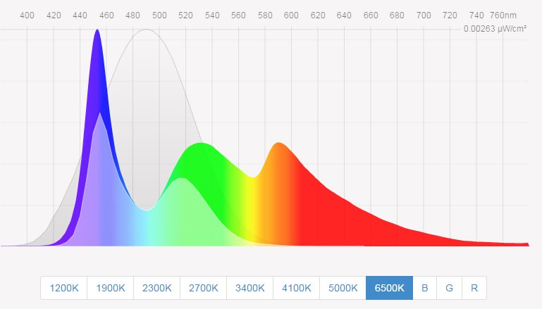
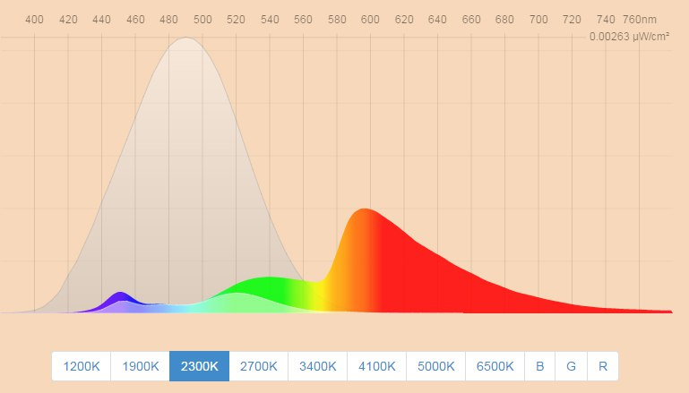

## Предисловие

Думаю мне не надо говорить о вреде недостатка сна и пользе жесткого режима, и это интуитивно понимают все. Также поясню, что здесь я касаюсь только дисплеев, обходя вниманием остальные техногенные и биогенные факторы.

## Необязательная часть

Вы живете в XXI веке, а сон для вас по прежнему что-то таинственное и неподвластное? Это норма.

Мы знаем что-то о "совах" и "жаворонках", но каждый раз нас затягивает в ритм "лечь попозже, встать пораньше". Мы молоды и активны, но все равно порой способны проваляться до глубокой ночи в попытках уснуть. Мы задумываемся о том, что пора бы все изменить, но смиряемся с повседневной действительностью. Я попробовал разобрать кое-какой заинтересовавший меня вопрос и пришел к интересным выводам.

Начнем по порядку. Может быть кто-то уже слыхал о Мелатонине? Сложно заставить себя спать в планируемое время, если мы имеем недостаток этого гормона, регулирующего наши день и ночь в необходимый момент. Наверное также кто-то слышал и о том, что "плохо за кампутером перед сном сидеть!", но всем на это, мягко говоря, плевать, потому что никто не объясняет причин.

Я попробую объяснить это. Причина, на мой взгляд, кроется в дисплеях, в тех которые повсюду. И дело не во вредном рентгене и прочей «радиации» времена которых далеко позади, дело в излучаемом дисплеями свете. Синий спектр света является проявлением пиковых показателей интенсивности излучения и имеет свойство подавлять выработку мелатонина.

И это очень даже правильно, ведь яркий «синий» дневной свет означает для нас бодрствование, а тусклый «красный» закат - начало сна, так уж сложилось.

Стоит добавить, что мелатонин не работает как ВКЛ/ВЫКЛ, он постепенно тормозит нас и готовит к процессам вызывающим сон. Консервативный человеческий организм нас спрашивает каждый раз: "откуда, [CENSORED], ночью синему спектру вообще взяться? Чушь!", и будет от части прав, так как с тех времен когда он был еще "обезьяньим", многие тысячи лет ему приходилось ориентировался на это.

Но в наше время синего излучения полно в любое время суток (при Сталине такого, наверное, не было) и отсюда наши проблемы со сном. Вот так вот. Решение проблемы очевидное: понижать синее излучение с заходом солнца. Как? Путем регулировки цветовой температуры дисплеев специальным ПО.

Таким образом из этого:

Mы к заходу солнца получаем это:

## Кратко

Итак, на самом деле весь предыдущий абзац читать необязательно, ведь помимо занудности он еще и не до конца все объясняет. Суть такова: ЧТОБЫ ПА ПРЕЖНИМУ СИДЕТЬ ЗА КАМПОМ ДО НОЧИ И ПАТОМ НОРМ ДРЫХНУТЬ НАДА СТАВИТЬ ПРОГИ!!1 Хотя вот мне после установки уже в 11-12 часов хотелось по-хорошему спать. Также это поможет избежать проблем со здоровьем в последующей жизни, а это типа важно, я серьезно.

## Примеры ПО:

https://justgetflux.com/#comments - Windows и прочие платформы. Собственно текст я писал уже в потеплевший монитор с помощью этого.
https://play.google.com/store/apps/details?id=com.urbandroid.lux&hl=ru - Аndroid. Снабдить телефон подобной функцией не менее важно, но пока не тестил.
