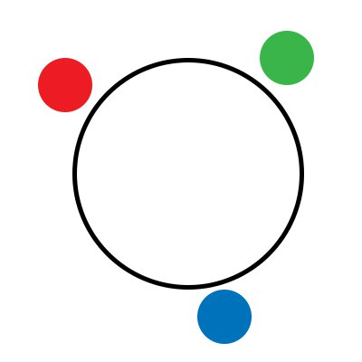
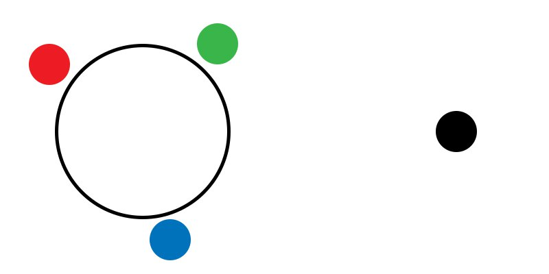
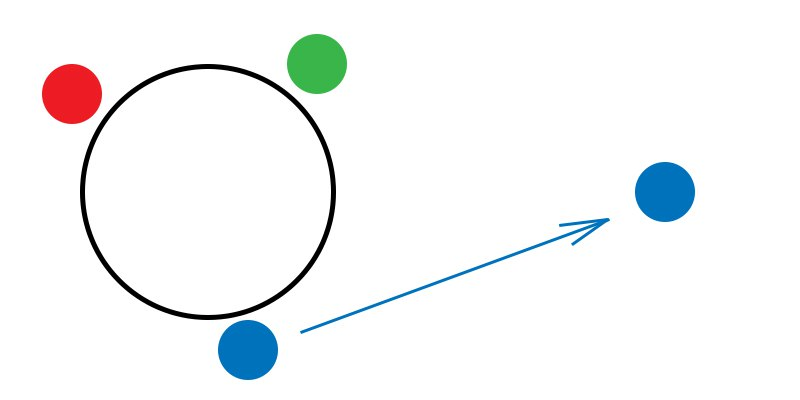
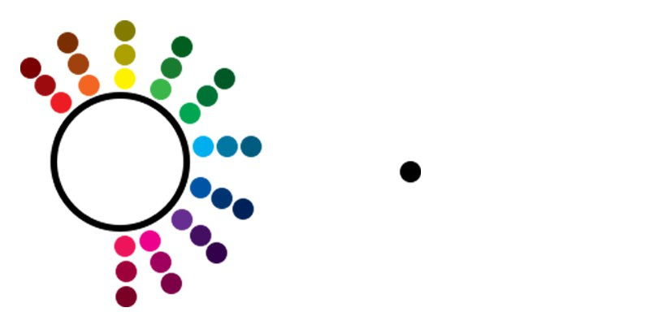
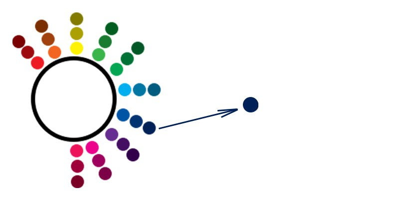
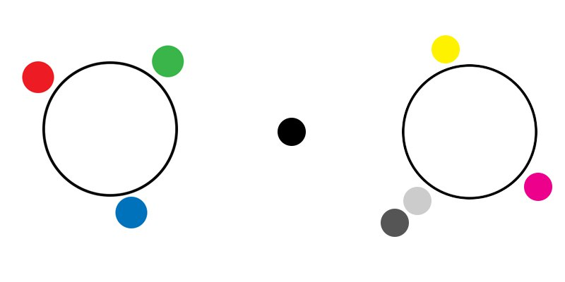
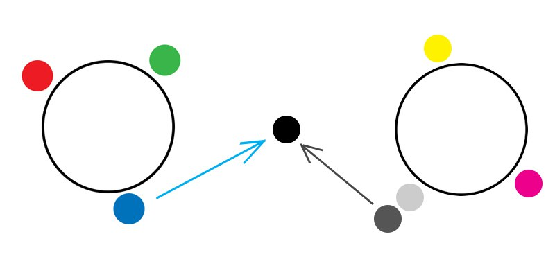
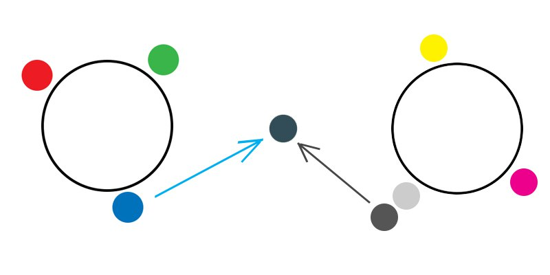
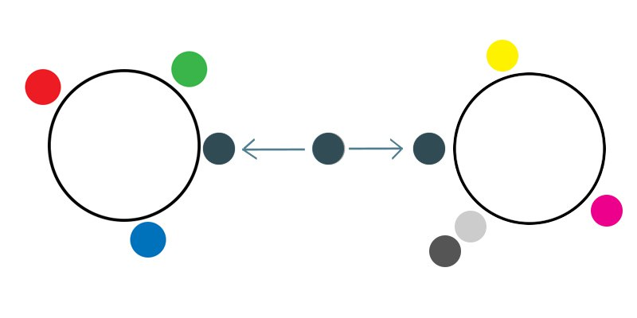
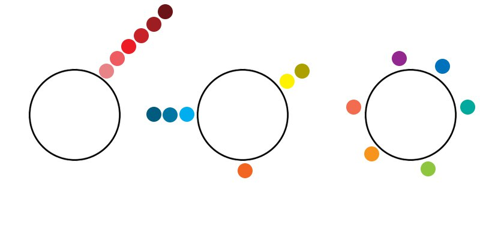

## Введение

Внезапный всплеск гениальности принудил написать меня эти строки. Если вы в данный момент не готовы к сверхинтеллектуальному чтиву, то рекомендую поберечь свои мозги. Сразу предупрежу: это будет моя ЕДИНСТВЕННО ВЕРНАЯ точка зрения и лучше бы вам к ней прислушаться, а еще лучше - полностью согласиться. Речь пойдет о сознании и восприятии, а это штуки сложные, даже сакральные. Очень не хотелось бы называть написанное теорией, потому что все так и работает на практике, однако скромность мне не чужда. Идея пришла в момент использования фразы "ты мыслишь стереотипно" в ответ на, поражающее глубиной, оценочное суждение. В общем, приготовьтесь понять кое-что важное.

## Суть

Итак, предадимся абстракции. В буду использовать для объяснения наиболее понятные всем "шаблоны" восприятия, но на самом деле так выглядело это в моей голове.

Представим (или увидим на изображении) условный центр в виде полого круга - это будет наш разум/сознание/память.
Разноцветные кружки, ошивающиеся рядом, являются, условно, знаниями/единицами опыта/понятиями.
Не стану затрагивать форму и размер, а лишь цвет и количество, так что запомните: ничто не важно кроме этих двух характеристик. Но также постарайтесь не ассоциировать цвета с чем-либо, важно то, что они разные и на этом все. Цвета три и они рядом с центром, значит предположим, что наш теоретический ум имеет три "знания" которые я назову стереотипами. Соответственно этот, чрезмерно скудоумный разум, обладает только тремя "цветами" мышления. Ими он мыслит/судит/воспринимает окружающий его мир.

Усложним ситуацию: на горизонте восприятия нашего разума появляется кружочек с новым цветом - что-то неизвестное. Но чтобы его можно было понять, нужно, для начала, воспринять. Проблема в том, что никто не способен воспринимать вещи такими, какие они есть на самом деле. Мы никак не можем выйти за рамки нашей сущности поэтому при восприятии в ход идут уже имеющиеся в запасе понятия/шаблоны/образы и это можно назвать идентификацией. Итак, наш теоретический разум до этого имел всего три цвета и только ими он может обозначить новый цвет. Согласитесь, весьма не точно называть черный цвет синим, но так и работает стереотипное мышление при недостаточном багаже знаний. Таким образом мы можем ошибаться, искренне считая себя истинно верными. Из этого следует, что никто и никогда не может воспринять что-то с абсолютной точностью.

Соответственно если разум обладает не тремя единицами знания, а, скажем, тремя тысячами (ну или десятками, для удобства изображения), то уже попадется не мало приближенных к черному цветов и цвет становится менее ошибочным. Именно менее ошибочным, а не более точным, ведь мы в любом случае не знаем истинного черного цвета. "А что нам мешает знать о черном заранее?", напрашивается вопрос. Повторюсь, не ассоциируйте, это абстракция и под черным я подразумевается априори что-то неизвестное.

Звучит не очень, мол есть "цвета" у нас в голове и мы ими все окрашиваем вокруг нас (кому-то вспомнится фраза с розовыми очками). А тогда откуда берутся новые? Из этого вопроса мне пришла в голову еще более интересная мысль. Я считаю, что приобретать новые "цвета" мы способны только при взаимодействии с другим разумом. И вот как это происходит:

Взаимодействие эффективнее в конфликте двух разумов (а под конфликтом я подразумеваю разницу в мышлении и отсутствие общего цвета в определении чего-либо), ну и при желании этих разумов прийти к консенсусу. Спустя время в конфликте рождается общий и новый для каждого цвет. Также это происходит при обучении, но уже в одностороннем порядке и обучаемый все равно получает в итоге отличное от преподаваемого понятие. Насколько оно будет отличаться, зависит как и от навыков обучающего, так и от имеющегося багажа обучающегося. Это можно отнести и к чтению книг. Вывод: разум способен усвоить новое знание только от другого разума, который изложил свою точку зрения в какой-либо степени доступно.

Теперь поговорим о цветах и понятиях "человек с узкой специализацией" и "человек широкого профиля" (многогранный). В этой модели идеально узкий специалист обладает большим спектром оттенков одного цвета, а идеально широкий - спектром разных цветов. На практике мы всегда имеем что-то промежуточное ведь идеала не существует.

## Выводы из описанного

- ▲ Конфликты очень полезны, но только если собеседники достаточно адекватны и держат себя в руках. А никто не говорил что это просто.
- ▲ Совместное познание с живым диалогом эффективнее.
- ▲ У более богатых на цвета собеседников большему можно научиться.
- ▲ Количество цветов конечно только на дисплеях, в реальности их бесконечное множество и смысл в том, чтобы успеть изучит как можно больше.
- ▲ Единомышленники это те, чьи цвета нам показались схожими с нашими. С ними проще, но новому учиться стоит у тех с кем мы не согласны.
- ▲ Стать рабом мнения очень просто, достаточно лишь фильтровать информацию от тех, кто с тобой не согласен и получить заветную ригидность. Вы великолепны!
- ▲ Люди не желающие вести диалог при конфликте будут считать, что собеседник им что-то навязывает, тем самым показывая, как они ценят то, что у них уже есть в голове, глупцы.
- ▲ Желание видеть "картину в целом" в какой-либо ситуации - ничто иное, как стремление увидеть происходящее с разных точек зрения и тем самым избежать ошибок восприятия.
- ▲ Консерваторы - люди экономящие ресурсы мозга, либо старики, либо слабаки.
- ▲ Наша точка зрения ничего не стоит и только в комплексе с иными, рождаются действительно хорошие идеи.
- ▲ Этим текстом я не пропагандирую гомосексуализм, вообще ничего не пропагандирую. Ничто не истинно.
