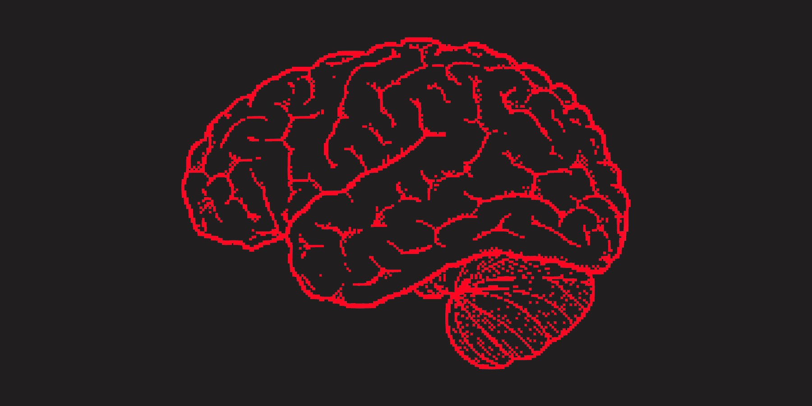

# Естественность против искусственности

**Естественность/Искусcтвенность = 80/20**

Данное соотношение тебе может быть знакомо по принципу Паретто, который гласит: "20 % усилий дают 80 % результата, а остальные 80 % усилий — лишь 20 % результата", золотые слова взятые за основу концепции. Речь пойдёт о примерном соотношении усилий в широком смысле слова и том, почему оно позволяет сохранять баланс и жить гармонично.

Пример: Басыгыс любит расхваливать себя за силу воли, он считает, что это его сильная сторона, которая позволяет ему быть мужиком добиваться целей и не быть лентяем в глазах окружающих. Конечно же, Басыгыс молчит про свою нервозность и запредельное количество уничижающей рефлексии по поводу не сделанного или сделанного не так. Это его грызёт, а также он любит выпить после работы "для расслабления". У Басыгыса есть уважение начальства (мнимое) и деньги на жизнь, но на деле он задроченный самоед. Так в чём же его проблема? В том, что Басыгыс переоценивает важность усилий над собой, ведь он считает, что потакание своим "хочу-нехочу" есть слабость и каждый раз старается задавить в себе эти позывы. Если выразиться в контексте заголовка, то Басыгыс уходит от соотношения 80/20, он не принимает своего естества и чрезмерно полагается на искусственные усилия над собой. Но так как он является человеком, то и имеет человеческие ограничения ресурсов, потому вылезают компенсирующие алкоголь, нервозность, самоедство и прочее.

К чему я клоню? Контроль над собой имеет предел. Сила воли, позволяющая действовать в разрез с внутренними желаниями, это эффективная и затратная способность. Нет развития без контроля своего поведения, этим люди отличаются от животных. Но часть энергии необходимая для эффективного роста не так велика как кажется.

Люди, которым сложно оперировать долгосрочными перспективами, желают добиваться результатов форсированно, что приводит к нестабильной жизни (диета-срыв, зубрежка-забивание, работа-алкоголь и многое подобное). Выходит синусоида зацикливающая ход мышления и аспекты жизни.

Важно понимание ограниченности ресурсов и их эффективного применения. Затрачивая только 20% сил для контроля над собой ты снизишь амплитуду цикличности, тем самым придешь к более гармоничной жизни. А придерживаясь мнения, что воля и дисциплина должны проявляться во всём, люди обесценивают этот контроль и его эффективность.

Помимо количества нужно помнить о качестве. Снизив долю искусственных усилий в жизни, ты сможешь увеличить их качество. Так, обычное рефлексивное самоедство перерастёт в признание ошибок и работу над ними. Принятие — чрезвычайно значимый, но только первый шаг на пути решения проблем.

Что такое естественное поведение? Это то поведение, которое полностью зависит от тебя нынешнего, то, что не требует дополнительного обдумывания и выполняется почти на автомате. Дело в том, что люди зачастую ненавидят себя именно за такое поведение, отрицая свою причастность к нему. Это и приводит к расстройствам личности. Увеличение качества искусственного приводит к принятию своих минусов как таковых и решает их, при необходимости, более плавно и эффективно.

Володя продолжит развивать эту концепцию идеей о "психологических мутациях", воспитании, и мотивации.
