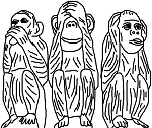
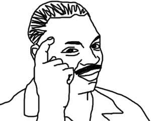
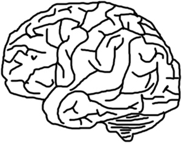
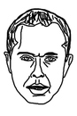

## Введение

> Если кто не знал, то cенсорная депривация — частичное или полное прекращение внешнего воздействия на один или более орган чувств, которое приводит к снижению потока нервных импульсов в центральную нервную систему.

В статье не затронуты физические эффекты, связанные с мышечным тонусом и спортивными показателями. Фокус направлен на ментальные изменения. Особое внимание уделено влиянию на креативность.

## Зачем?

Спектр применения расширяется с каждым годом. Кому-то заменяет сон, кто-то восстанавливает тело и разум, кто-то галлюцинирует и копается в себе, кого-то привлекают лечебные эффекты. В конце концов есть те, кому интересен подобный опыт сам по себе.

При депривации ЦНС адаптируется к малому количеству ощущений. В теории это рождает любопытные сенсорные эффекты, помогает погрузиться на недоступный без тренировок уровень медитации, существенно упрощает рефлексию, повышает вероятность трансцендентного состояния, регулирует биохимию мозга.

## Как добиться?

Флоатинг (англ. floating) или REST (Restricted Environmental Stimulation Technique) — способ, позволяющий испытать максимально возможную сенсорную депривацию.

Для сеанса человек ложится в солёную воду температуры тела, находясь в камере или комнате со свето- и шумо- изоляцией. Так создаётся эффект парения в пустоте. Период пребывания в этом состоянии длится от часа до целой ночи.
Для статьи подопытный (Володя) испытал два часовых сеанса в одиночестве, которых оказалось достаточно при всех сомнениях.

## Субъективно

### 05.05.17

Сеанс прошёл в целом неудачно. Володя совершил критические ошибки из-за которых депривация была недостаточной и ему не удалось проникнуться состоянием. Мешали звуки коммуникаций здания, цокот дамских каблуков, были видимы очертания комнаты после того как зрение приспособилось. Ничего кроме много раз описанных наблюдений он не обнаружил. Это не соответствовало ожиданиям и не стоило номинальной цены.

Учтённые ошибки: под вечер уровень фонового шума ниже чем днём, не стоит забывать выключить свет в "предбаннике", личные силиконовые беруши надёжнее выдаваемых на месте (об этом ниже), ни в коем случае нельзя поддаваться желанию уснуть.

### 16.05.17

Второй сеанс получился глубже, а депривация была полноценной. Володе показалось, что он выжал максимум пользы, но это не так. Он не представлял нижеперечисленных ощущений второго сеанса сразу после первого. Теперь есть основания считать, что и у последующих минимум трёх сеансов будут сюрпризы.

### Список выводов

I. Выделенные стадии:

- Дезориентация и обычное мышление
- Адаптация с навязчивыми мыслями об актуальных проблемах
- Сонливость и тяжелые веки
- Уход в себя, поток идей, сны наяву

II. Мозг решает, что лучший способ избежать депривации — уснуть. Он убедителен, но ему нельзя верить потому что награда за неотступность того стоит.

III. Простота наблюдения за собственными мыслями (рефлексия). Это позволяет обнаружить пару изъянных закономерностей и зацикленности мышления без помощи извне.

IV. Визуальные галлюцинации и сны наяву. Удивительно видеть сюрреалистический сюжет бодрствуя и не закрывая глаз. Ясно наблюдаются образы, которыми наполнена голова.

V. Околопоточное состояние. Возникающие идеи проходят итерации и нравятся всё больше. Похоже на ночную депривацию, но без возможности творить и ущерба для мозга.
Очень помогает умение направлять мысли в сторону важных тем, однако это всё равно проще чем обычно.

VI. Самотрансценденция (по Хаксли). Мысли о конфликтах, дОлгах и взаимоотношениях воспринимаются как будто человеком извне, который видит картину более целостно и без труда находит возможные пути разрешения.
Восприятие самого себя даёт хорошую обратную связь и ещё та наркомания.

VII. Ощущение нахождения глубоко внутри себя и что ничто не важно кроме факта твоего существования и возможности мыслить.
Володе удалось на миг представить, что он пропал в себе навсегда. Не делай так.

VIII. Час даже без сна пролетел очень быстро. И всё же больше часа за раз — лишнее.

IX. Проскакивали панические и тревожные мысли. Было неприятно, так что самообладание мастхэв.

## Объективно

Исследования с соблюдением научного метода ближе к объективности.
Изначально Володя ожидал найти всего несколько исследований для этого раздела. Но обнаружились списки с десятками исследований и научных работ. Самый подробный и многочисленный список находится здесь.
Останавливаться на конкретных статьях для детального разбора оказалось сомнительной стратегией, зато при беглом изучении стали понятны основные выводы:

- Периодически повторяемый флоатинг существенно эффективнее разовых сеансов.
- Флоатинг имеет долгосрочное положительное влияние вплоть до нескольких месяцев в некоторых случаях.
- Улучшает сон, снижает хронические боли, нивелирует последствия стресса (на уровне биохимии).
- Флоатингом лечат ряд заболеваний (гипертензия, психофизическая бессонница, фибромиалгия, ревматойдный артрит, наркотические зависимости и даже "въетнамский синдром").
- Способствует разрешению внутренних и внешних конфликтов.
- Прокачиваются креативность и осознанность. Подтвердилось на практике.

Подтверждение к каждому из этих пунктов я предоставлять конечно же не буду.

## Общие выводы

Этой статьёй Володя добился одного гарантированного результата — продал флоатинг самому себе и теперь у него дополнительная статья расходов и желание депривировать хотя бы раз в три-четыре месяца. Он стал чаще медитировать только потому что это оказалось слабым, но доступным аналогом по получению идей и мотивации. Полученное вдохновение и идеи были направлены на пару новых проектов, о которых рано говорить.

Наиболее важным фактором является отсутствие отвлекающих стимулов, ведь даже самые тихие шорохи сбивают с фокуса. Идеальной изоляции добиться сложно, что показал первый опыт флотации. Однако ко второму сеансу с незначительными мерами внешние факторы исчезли полностью. И это дорогого стоит. С трудом верится, что каждый флоат-центр способен обеспечить депривацию как таковую, а вот относительное спокойствие без проблем. Также не проблема обеспечить комфортный сервис с чаепитием и обсуждением после сеанса. В итоге Володя не верит флоат-центрам и готов платить только тем, кто может дать гарантированный опыт депривации.

У Володи есть пара идей по улучшению услуги:

- Силиконовые беруши. Вместо одноразовых из вспененного материала, которые никуда не годятся. (UPD: возможно уже исправлено)
- Шумовая завеса. Мозгу сложно воспринимать хаотичную информацию от белого шума и потому он игнорирует её. Белый шум имеет свойство заглушать другие звуки и аналогичен тишине. Будет хорошей идеей включать его если в центре много людей или шумно на улице.
